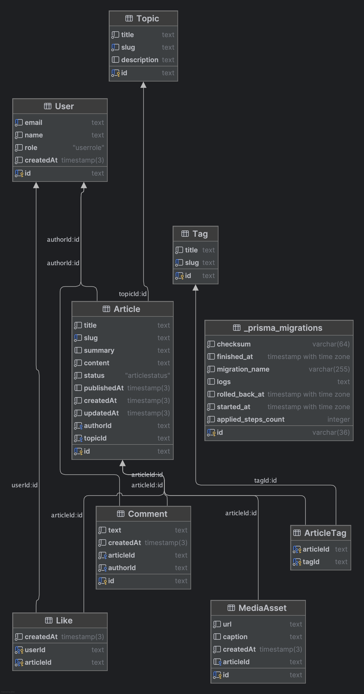

# Квантик — NestJS + Render

# Kvantik Nest (LR1)

Автор: Арсений Краковский, группа м3306

NestJS-приложение с деплоем на Render, подключением MVC (EJS) и отдачей статических файлов из public.
Реализованы шаблоны и partials (header/menu/footer/session) + страницы index/articles.

Демо: https://kvantik-nest.onrender.com

## Описание

Сайт научно‑популярного онлайн‑журнала «Квантик». Проект развёрнут на Render и использует MVC‑шаблонизацию (EJS) для повторяющихся блоков страниц.

## Ссылка на развёрнутое приложение

- Render: <PASTE_YOUR_RENDER_URL_HERE>

## Запуск локально

```bash
npm install
npm run start:dev
```

Открыть: http://localhost:3000

## Проверка PORT

Можно запустить на другом порту:

```bash
PORT=4000 npm run start:dev
```

---

# ЛР2 — доменная модель + PostgreSQL

## ORM (Prisma)

Схема находится в `prisma/schema.prisma`.

Команды:

```bash
npm install
npm run prisma:generate
npm run prisma:migrate
```

Для Render (production)  миграции:

```bash
npm run prisma:migrate:deploy
```

Проверка подключения (на запущенном сервере):

- `GET /db/ping`

## ER-диаграмма


