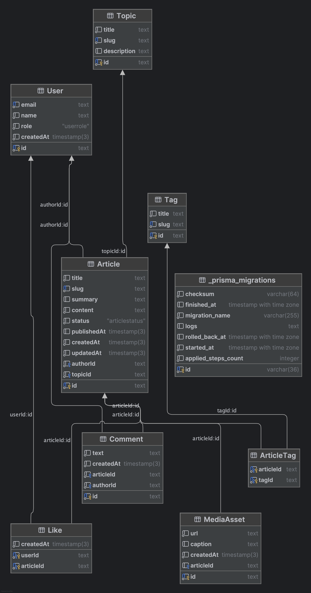

# Квантик — NestJS + Render

# Kvantik Nest (LR1)

Автор: Арсений Краковский, группа м3306

NestJS-приложение с деплоем на Render, подключением MVC (EJS) и отдачей статических файлов из public.
Реализованы шаблоны и partials (header/menu/footer/session) + страницы index/articles.

Демо: https://kvantik-nest.onrender.com

## Описание

Сайт научно‑популярного онлайн‑журнала «Квантик». Проект развёрнут на Render и использует MVC‑шаблонизацию (EJS) для повторяющихся блоков страниц.

## Ссылка на развёрнутое приложение

- Render: <PASTE_YOUR_RENDER_URL_HERE>

## Запуск локально

```bash
npm install
npm run start:dev
```

Открыть: http://localhost:3000

## Проверка PORT

Можно запустить на другом порту:

```bash
PORT=4000 npm run start:dev
```

---

# ЛР2 — доменная модель + PostgreSQL

## ORM (Prisma)

Схема находится в `prisma/schema.prisma`.

Команды:

```bash
npm install
npm run prisma:generate
npm run prisma:migrate
```

Для Render (production)  миграции:

```bash
npm run prisma:migrate:deploy
```

Проверка подключения (на запущенном сервере):

- `GET /db/ping`

## ER-диаграмма




## ЛР3: MVC + DDD-модули + SSE

Структура
•	Поддомены вынесены в отдельные модули (DDD-подход): articles/, topics/, users/
•	Бизнес-логика находится в *.service.ts, контроллеры отвечают за маршрутизацию и рендер шаблонов
•	Шаблоны: views/*, общая разметка через layout/partials

Маршруты (CRUD)

Articles
•	GET /articles — список
•	GET /articles/:id — просмотр
•	GET /articles/add — форма создания
•	POST /articles — создание
•	GET /articles/:id/edit — форма редактирования
•	PATCH /articles/:id — обновление
•	DELETE /articles/:id — удаление

Topics
•	GET /topics, GET /topics/:id, GET /topics/add, POST /topics, GET /topics/:id/edit, PATCH /topics/:id, DELETE /topics/:id

Users
•	GET /users, GET /users/:id, GET /users/add, POST /users, GET /users/:id/edit, PATCH /users/:id, DELETE /users/:id

Для отправки PATCH/DELETE из HTML-форм используется ?_method=PATCH / ?_method=DELETE.

SSE (обновления в реальном времени)
•	GET /articles/sse — Server-Sent Events поток
•	На странице /articles подключён EventSource, изменения (create/update/delete) показываются toast-уведомлениями без перезагрузки страницы.

Запуск
```bash
npm i
npm run start:dev
```
